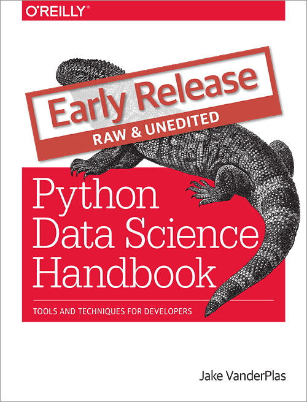

# Python Data Science Handbook Supplemental Materials

Supplemental materials for my OReilly project, the
[Python Data Science Handbook](http://shop.oreilly.com/product/0636920034919.do)

See also the free companion project, [A Whirlwind Tour of Python](https://github.com/jakevdp/WhirlwindTourOfPython).

## Code Listings

All the code from the book can be found in [code_listings](code_listings).
The code is in IPython notebooks, organized by book chapter and section.
All code from this book was tested with Python 3.4-3.5, though it should be
near 100% compatible with Python 2.7 as well.

## Figure Appendix

Nearly every figure used in the book was generated using Matplotlib.
Most figures are generated by the code within the text; those few that are not
can be found in the online-only [Figure Appendix](figure_appendix/06.00-Figure-Code.ipynb)

## Full Notebooks

The full notebooks, containing the entire text of the book, are being edited and will be posted in [notebooks](notebooks).

## License
The code here is released under the [MIT license](LICENSE-CODE). Read more at the [Open Source Initiative](https://opensource.org/licenses/MIT).

The textual content of the book is released under the [CC-BY-NC-ND license](LICENSE-TEXT). Read more at [Creative Commons](https://creativecommons.org/licenses/by-nc-nd/3.0/us/legalcode).
