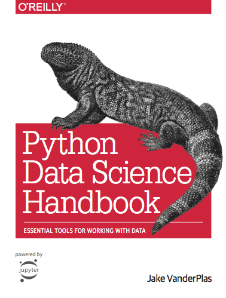

---
jupyter:
  jupytext:
    formats: ipynb,md
    text_representation:
      extension: .md
      format_name: markdown
      format_version: '1.3'
      jupytext_version: 1.13.0
  kernelspec:
    display_name: Python 3
    language: python
    name: python3
---

# Python Data Science Handbook

*Jake VanderPlas*

This is the Jupyter notebook version of the [Python Data Science Handbook](http://shop.oreilly.com/product/0636920034919.do) by Jake VanderPlas; the content is available [on GitHub](https://github.com/jakevdp/PythonDataScienceHandbook).*
The text is released under the [CC-BY-NC-ND license](https://creativecommons.org/licenses/by-nc-nd/3.0/us/legalcode), and code is released under the [MIT license](https://opensource.org/licenses/MIT). If you find this content useful, please consider supporting the work by [buying the book](http://shop.oreilly.com/product/0636920034919.do)!

## Table of Contents

### [Preface](00.00-Preface.ipynb)

### [1. IPython: Beyond Normal Python](01.00-IPython-Beyond-Normal-Python.ipynb)
- [Help and Documentation in IPython](01.01-Help-And-Documentation.ipynb)
- [Keyboard Shortcuts in the IPython Shell](01.02-Shell-Keyboard-Shortcuts.ipynb)
- [IPython Magic Commands](01.03-Magic-Commands.ipynb)
- [Input and Output History](01.04-Input-Output-History.ipynb)
- [IPython and Shell Commands](01.05-IPython-And-Shell-Commands.ipynb)
- [Errors and Debugging](01.06-Errors-and-Debugging.ipynb)
- [Profiling and Timing Code](01.07-Timing-and-Profiling.ipynb)
- [More IPython Resources](01.08-More-IPython-Resources.ipynb)

### [2. Introduction to NumPy](02.00-Introduction-to-NumPy.ipynb)
- [Understanding Data Types in Python](02.01-Understanding-Data-Types.ipynb)
- [The Basics of NumPy Arrays](02.02-The-Basics-Of-NumPy-Arrays.ipynb)
- [Computation on NumPy Arrays: Universal Functions](02.03-Computation-on-arrays-ufuncs.ipynb)
- [Aggregations: Min, Max, and Everything In Between](02.04-Computation-on-arrays-aggregates.ipynb)
- [Computation on Arrays: Broadcasting](02.05-Computation-on-arrays-broadcasting.ipynb)
- [Comparisons, Masks, and Boolean Logic](02.06-Boolean-Arrays-and-Masks.ipynb)
- [Fancy Indexing](02.07-Fancy-Indexing.ipynb)
- [Sorting Arrays](02.08-Sorting.ipynb)
- [Structured Data: NumPy's Structured Arrays](02.09-Structured-Data-NumPy.ipynb)

### [3. Data Manipulation with Pandas](03.00-Introduction-to-Pandas.ipynb)
- [Introducing Pandas Objects](03.01-Introducing-Pandas-Objects.ipynb)
- [Data Indexing and Selection](03.02-Data-Indexing-and-Selection.ipynb)
- [Operating on Data in Pandas](03.03-Operations-in-Pandas.ipynb)
- [Handling Missing Data](03.04-Missing-Values.ipynb)
- [Hierarchical Indexing](03.05-Hierarchical-Indexing.ipynb)
- [Combining Datasets: Concat and Append](03.06-Concat-And-Append.ipynb)
- [Combining Datasets: Merge and Join](03.07-Merge-and-Join.ipynb)
- [Aggregation and Grouping](03.08-Aggregation-and-Grouping.ipynb)
- [Pivot Tables](03.09-Pivot-Tables.ipynb)
- [Vectorized String Operations](03.10-Working-With-Strings.ipynb)
- [Working with Time Series](03.11-Working-with-Time-Series.ipynb)
- [High-Performance Pandas: eval() and query()](03.12-Performance-Eval-and-Query.ipynb)
- [Further Resources](03.13-Further-Resources.ipynb)

### [4. Visualization with Matplotlib](04.00-Introduction-To-Matplotlib.ipynb)
- [Simple Line Plots](04.01-Simple-Line-Plots.ipynb)
- [Simple Scatter Plots](04.02-Simple-Scatter-Plots.ipynb)
- [Visualizing Errors](04.03-Errorbars.ipynb)
- [Density and Contour Plots](04.04-Density-and-Contour-Plots.ipynb)
- [Histograms, Binnings, and Density](04.05-Histograms-and-Binnings.ipynb)
- [Customizing Plot Legends](04.06-Customizing-Legends.ipynb)
- [Customizing Colorbars](04.07-Customizing-Colorbars.ipynb)
- [Multiple Subplots](04.08-Multiple-Subplots.ipynb)
- [Text and Annotation](04.09-Text-and-Annotation.ipynb)
- [Customizing Ticks](04.10-Customizing-Ticks.ipynb)
- [Customizing Matplotlib: Configurations and Stylesheets](04.11-Settings-and-Stylesheets.ipynb)
- [Three-Dimensional Plotting in Matplotlib](04.12-Three-Dimensional-Plotting.ipynb)
- [Geographic Data with Basemap](04.13-Geographic-Data-With-Basemap.ipynb)
- [Visualization with Seaborn](04.14-Visualization-With-Seaborn.ipynb)
- [Further Resources](04.15-Further-Resources.ipynb)

### [5. Machine Learning](05.00-Machine-Learning.ipynb)
- [What Is Machine Learning?](05.01-What-Is-Machine-Learning.ipynb)
- [Introducing Scikit-Learn](05.02-Introducing-Scikit-Learn.ipynb)
- [Hyperparameters and Model Validation](05.03-Hyperparameters-and-Model-Validation.ipynb)
- [Feature Engineering](05.04-Feature-Engineering.ipynb)
- [In Depth: Naive Bayes Classification](05.05-Naive-Bayes.ipynb)
- [In Depth: Linear Regression](05.06-Linear-Regression.ipynb)
- [In-Depth: Support Vector Machines](05.07-Support-Vector-Machines.ipynb)
- [In-Depth: Decision Trees and Random Forests](05.08-Random-Forests.ipynb)
- [In Depth: Principal Component Analysis](05.09-Principal-Component-Analysis.ipynb)
- [In-Depth: Manifold Learning](05.10-Manifold-Learning.ipynb)
- [In Depth: k-Means Clustering](05.11-K-Means.ipynb)
- [In Depth: Gaussian Mixture Models](05.12-Gaussian-Mixtures.ipynb)
- [In-Depth: Kernel Density Estimation](05.13-Kernel-Density-Estimation.ipynb)
- [Application: A Face Detection Pipeline](05.14-Image-Features.ipynb)
- [Further Machine Learning Resources](05.15-Learning-More.ipynb)

### [Appendix: Figure Code](06.00-Figure-Code.ipynb)
